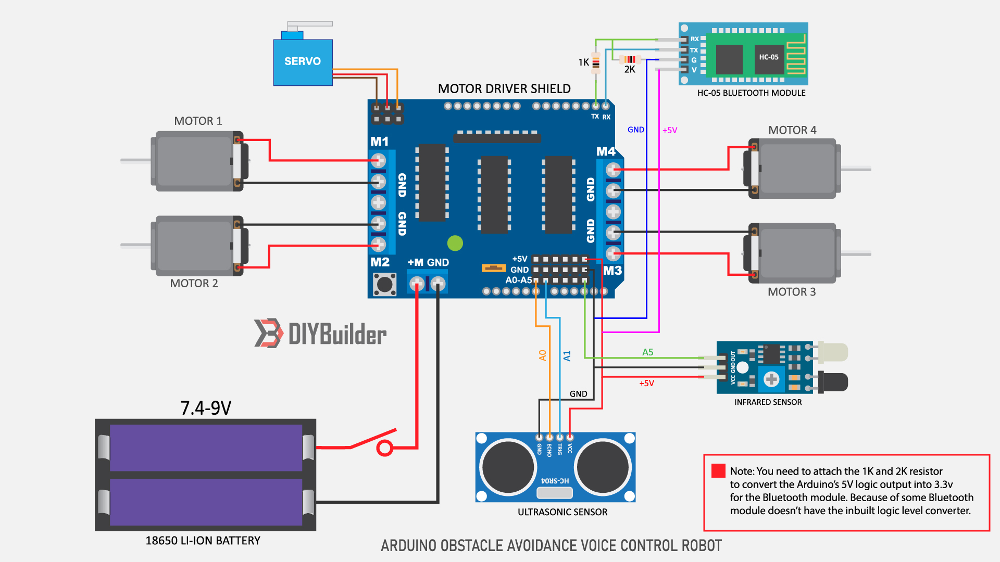
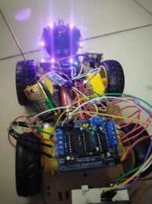
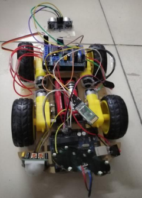

The Surface Disinfecting Obstacle Avoiding Robot project, represents a cutting-edge solution to the critical challenge of surface sterilization within enclosed spaces. At its conceptual core, the project focuses on harnessing the power of autonomous robotics to enhance the efficiency and efficacy of disinfection processes. The utilization of UV-light technology serves as a pivotal element in this endeavor, as it enables the robot to systematically eradicate a wide array of microorganisms, ranging from viruses and bacteria to fungi, on surfaces.
./

What sets this project apart is not only its commitment to the thorough sterilization of spaces but also its emphasis on autonomous operation. The robot is designed to navigate through environments without the need for human intervention, significantly reducing the risk of individuals being exposed to potentially harmful pathogens. The incorporation of ultrasonic sensors for obstacle avoidance further enhances the robot's adaptability, allowing it to intelligently maneuver around physical barriers, ensuring a seamless and safe disinfection process in diverse settings.

./

./

A noteworthy feature of the project is the inclusion of a safety mechanism that addresses concerns associated with UV light exposure. By integrating PIR sensors, the system can detect human motion in close proximity and automatically switch off the UV lights. This thoughtful consideration reflects a deep commitment to user safety, making the robot not only technologically advanced but also practical and user-friendly. In essence, the project stands as a testament to the team's innovative thinking and their dedication to leveraging technology for public health and safety in the face of infectious diseases.
